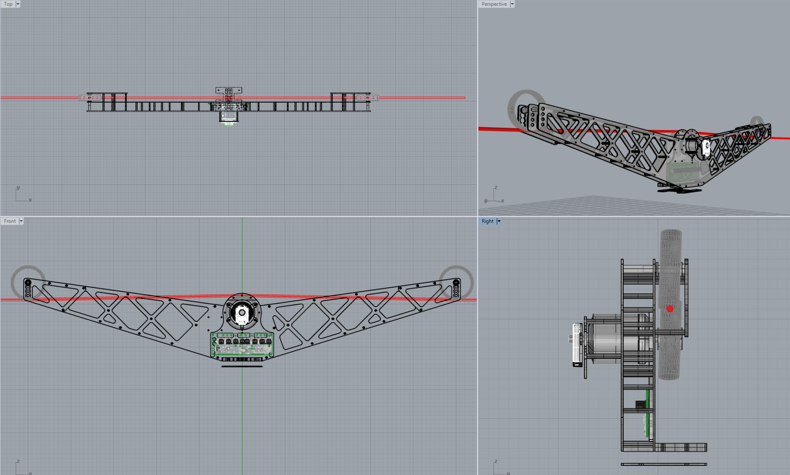
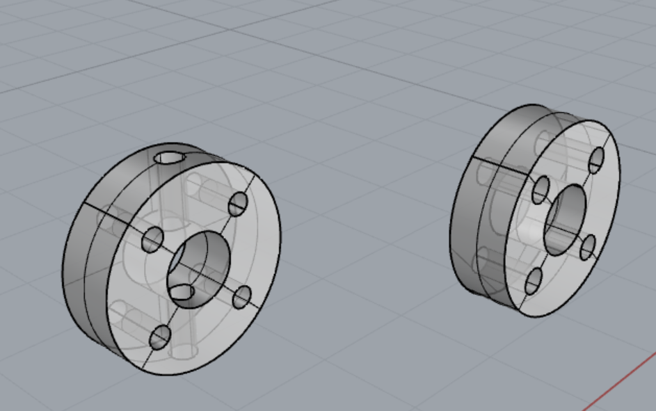
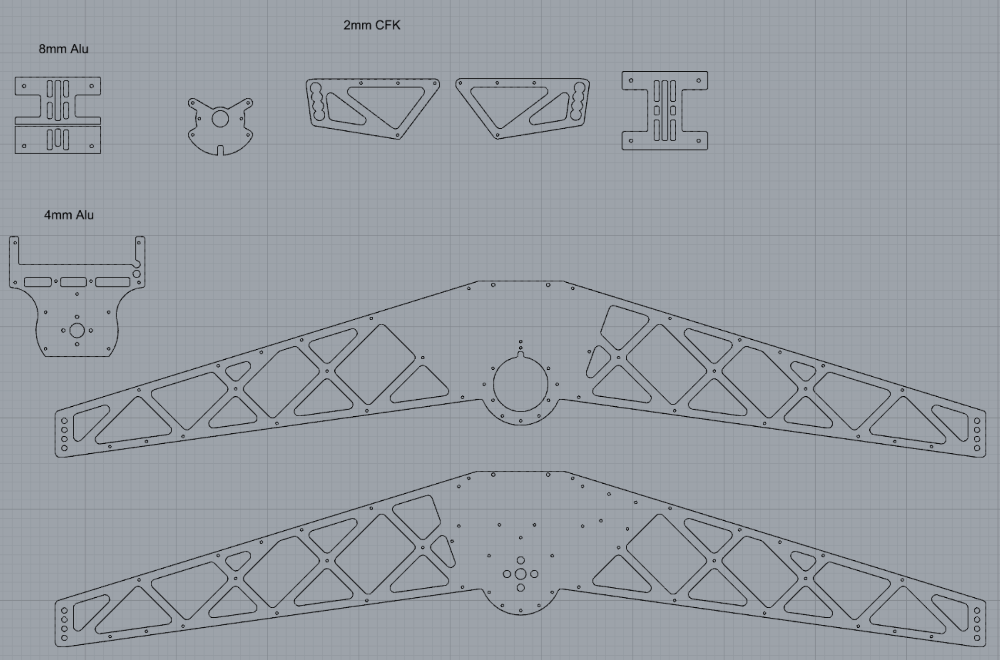

[LICENSE](LICENSE)

# Direct Drive CableCam

This is the version for the ODrive Robotics [motor controller](https://odriverobotics.com/shop/odrive-v35) and the [D5065 dual shaft motor](https://odriverobotics.com/shop/odrive-custom-motor-d5065) with [encoder](https://odriverobotics.com/shop/cui-amt-102).

The CAD program primarily used is Rhino 3D V5.0 ([cablecam.3dm](cablecam_DirectDrive.3dm)) but for better portability the exact same content is exported as AutoCAD ([cablecam.dxf](cablecam_DirectDrive.dxf)) and Step file ([cablecam.stp](cablecam_DirectDrive.stp)).

In case one of the files has a problem, file an Issue in this repository.

Generally speaking, the plans consists of three areas:

## 3D Model of the assembled CableCam using multiple layers
Here the entire CableCam can be seen.

## Drive Shaft assembly
The drive dog is a simple D22x7xd8 disk to be clamped to the motor axle and holds the inline skate wheels.

## Main body in 2D
The main body consists of 2mm thick CFK mostly, except for the base plate where the Gimbal will be mounted on, that is 8mm thick alu and the motor assembly plate made of 4mm alu.
These parts did undergo several iterations of design, e.g. initially some parts were 2.5D elements and had to be milled. To safe costs all has been redesigned to be pure 2D parts and waterjet cutting provide the best result. A clean surface with just a bit of chamfer needed afterwards - to make it perfect - and the cheapest way to manufacture all.

## Bill of Material

Item | | Qty
-----|-----|-----
Inbusschraube niedriger Kopf M4x10 |Befestigung Motor and Motorträger | 4 
Zylinderkopfschraube M3x12 |Odrive Controller Befestigung | 4 
Stoppmutter M3 |Odrive Controller Befestigung | 4 
Distanzscheibe d3x1 Kunststoff |Odrive Controller Befestigung | 4 
Zylinderkopfschraube M3x12 |Motorträger an Seitenwange1 | 5 
Stoppmutter M3 |Motorträger an Seitenwange1 | 5 
Unterlegscheibe d3 |Motorträger an Seitenwange1 | 5 
 Zylinderkopfschraube M3x12 | Seitenwange1 | 22 
 Distanzmutter M3x30 | Seitenwange1 | 22 
 Distanzmutter M3x30 | Seitenwange1 Seilkäfig | 12 
 Madenschraube M3x12 | Seitenwange1 Seilkäfig | 6 
 Zylinderkopfschraube M6x16 | Laufradbefestigung | 2 
 Distanzmutter M6x30 | Laufradbefestigung | 2 
 Zylinderkopfschraube M3x16 | Seitenwange2 CC3D | 4 
 Distanzhülse M3x6 Kunststoff | Seitenwange2 CC3D | 4 
 Stoppmutter M3 | CC3D Befestigung | 4 
 Zylinderkopfschraube M4x50 | Gimbalträger | 2 
 Stoppmutter M4 | Gimbalträger | 2 
 Zylinderkopfschraube M3x12 | Encoderträger | 4 
 Distanzmutter M3x35 | Encoderträger | 4 
 Zylinderkopfschraube M3x12 | Seitenwange2 | 31 
 Zylinderkopfschraube M3x12 | Encoderdeckel | 4 
 Zylinderkopfschraube M3x12 | Encoder | 2 
 Stoppmutter M3 | Encoder | 2 
 Unterlegscheibe d3 | Encoder | 2 
 Zylinderkopfschraube M3x12 | Laufradkäfig | 6 
 Zylinderkopfschraube M6x40 | Laufrad | 2 
 Unterlegscheibe d6 | Laufrad | 4 
 Stiftschraube mit Ringschneide M4x6 | Mitnehmer | 2 
 Zylinderkopfschraube M3x25 | Klemmung Antriebsrad | 4 

## Assembly

[Assembly.md](Assembly.md)
